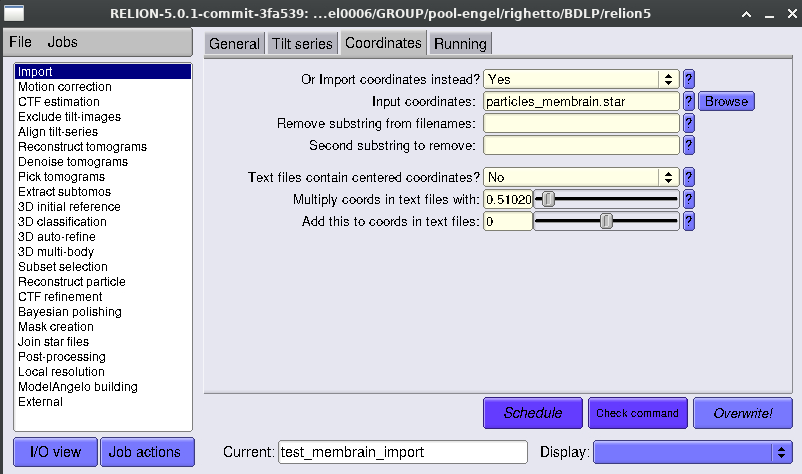
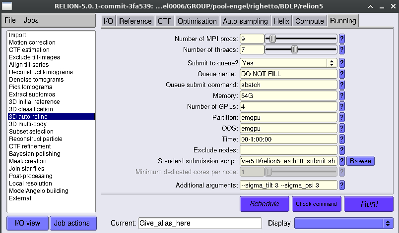
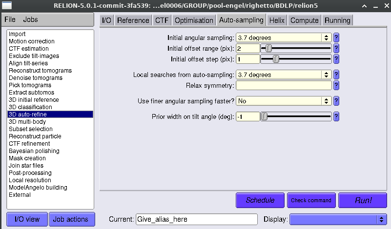

# Importing STAR files from MemBrain-pick into Relion-5

## Overview
Once you are satisfied with your particle picks after following the previous steps, you can import them into [RELION-5](https://relion.readthedocs.io/en/release-5.0/) for subtomogram averaging. For a detailed, step-by-step tutorial on subtomogram averaging with RELION-5, we refer you to the [official tutorial](https://relion.readthedocs.io/en/release-5.0/STA_tutorial/index.html) as well as the [TomoGuide](https://tomoguide.github.io). Here, we will focus on the steps that are specifically related to MemBrain-pick, namely, the importing of particle coordinates as well as how to run constrained angular searches during 3D refinement and classification.

## Importing particles
After the [prediction](../Prediction.md) step, MemBrain-pick should have generated one STAR file per segmented membrane, similar to the one below:

```

data_

loop_
_rlnCoordinateX #1
_rlnCoordinateY #2
_rlnCoordinateZ #3
_rlnAngleRot #4
_rlnAngleTilt #5
_rlnAnglePsi #6
5904.217285	4464.462891	2593.735107	87.142778	91.651887	30.010083
5907.051758	4423.755371	2330.111572	76.163535	97.265316	27.178633
5946.418457	4455.405762	2078.243164	84.601583	92.932160	28.427001
```

### Preparing the master STAR file
In order to import into RELION-5, you should use your favorite text editor or a little script to generate a "master" STAR file associating all the per-membrane STAR files (as exemplified above) to their respective tomograms, which should look like the example below. Let's call this file `particles_membrain.star`:

```
data_particles

loop_
_rlnTomoName #1
_rlnTomoImportParticleFile #2
tomo_0001  membrain-pick/membrain_pick_output/tomo_0001_T1S1M01_clusters.star
tomo_0002  membrain-pick/membrain_pick_output/tomo_0002_T2S1M01_clusters.star
tomo_0002  membrain-pick/membrain_pick_output/tomo_0002_T2S1M02_clusters.star
tomo_0003  membrain-pick/membrain_pick_output/tomo_0001_T3S1M01_clusters.star
```

**NOTE:** The paths indicated in the `rlnTomoImportParticleFile` column should be relative to your RELION project directory.

### Importing into RELION
You now need to consider what is your unbinned pixel size, so that the coordinates are scaled properly. Internally, MemBrain-pick assumes the `rlnCoordinate<X/Y/Z>` columns are in *non-centered Å*; RELION-5, however, [expects](https://relion.readthedocs.io/en/latest/Reference/STA/Datatypes/particle_set.html) these values to be in unbinned *pixels* if the columns have this name (not to be confused with the default `rlnCenteredCoordinate<X/Y/Z>Angst` columns). It is therefore just a matter of applying a scaling factor, which should be supplied in the `Coordinates` tab of the RELION **Import** job. If your unbinned pixel size is 1.96 Å, you should therefore supply 1/1.96 = 0.51020408 as your scaling factor to convert the coordinates back to pixels.

Assuming you already have an existing RELION tomography project with all the proper tilt series data imported/processed, you can then import the particles by running an **Import** job as follows:



#### Known issues
Currently, the membrane labels (e.g. `T1S1M01`) are lost when importing into RELION. Preserving this label is on our TO-DO list. Optionally, you can write a little script to insert a label into each of your particle STAR files, which RELION will preserve upon importing.

### Testing the import

Once coordinates and initial Euler angles have been imported, it is highly recommend to run a **Reconstruct particle** job to see if RELION properly understood the particle STAR files. Since the in-plane angles are randomized at this point, you should obtain an average that is (roughly) rotationally averaged around the Z axis. For details of running this job, please refer to the [official tutorial](https://relion.readthedocs.io/en/latest/STA_tutorial/ReconstructPart.html) or the [TomoGuide](https://tomoguide.github.io/03-tutorial/05-sta-in-relion5/#extract-your-particles-and-check-your-average). It is also recommended to visually inspect the imported particle coordinates and orientations in [ArtiaX](https://github.com/FrangakisLab/ArtiaX) as explained in the [TomoGuide](https://tomoguide.github.io/03-tutorial/04-template-matching/#visualisation-in-chimerax-using-artiax).

## Running refinement and classification
Particle picks from MemBrain-pick are already pre-oriented normal to the membrane, but are randomly oriented within the membrane plane. This means that you don't need to run a full global search when running alignment and classication jobs in RELION. You can just do a full in-plane search, and a tiny local cone-like search around the vector normal to the membrane.

For doing this, in the `Sampling` (**3D classification**) or `Auto-sampling` (**3D auto-refine**) tab you first define the global angular ampling interval. In the example below, this is 7.5 degrees:


Then in the `Running` tab you should supply additional arguments to impose a small Gaussian prior on the `rlnAngleRot` and `rlnAnglePsi` Euler angles. In the example below, we impose a prior with a 3-degree standard deviation (`--sigma_tilt 3 --sigma_psi 3`):



Along the refinement and classification rounds, you should always inspect your particle orientations in [ArtiaX](https://github.com/FrangakisLab/ArtiaX) as explained in the [TomoGuide](https://tomoguide.github.io/03-tutorial/04-template-matching/#visualisation-in-chimerax-using-artiax) to make sure the angular searches are behaving as expected.

### Doing local searches
As is usual, once your subtomogram average improves and angles start to converge, you can run **3D auto-refine** jobs with only *local* searches. For this, you just need to supply the same initial sampling interval for both global and local searches, which is 3.7 degrees in the example below. There is no need to provide additional arguments in the `Running` tab now.


